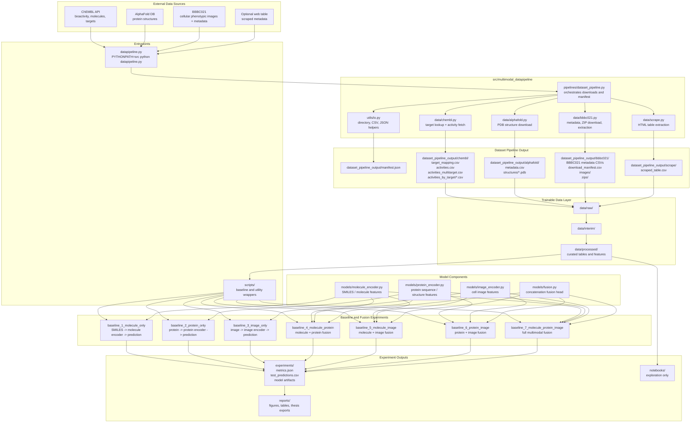

# Multimodal Data Pipeline Architecture

## Main Flow

1. `datapipeline.py` calls `src/multimodal_datapipeline/pipelines/dataset_pipeline.py`.
2. The pipeline downloads or scrapes ChEMBL, AlphaFold, BBBC021, and optional tabular web data.
3. Downloaded artifacts are written under `dataset_pipeline_output/`.
4. Curated and trainable datasets are organized through `data/raw/`, `data/interim/`, and `data/processed/`.
5. Baseline scripts consume processed data and route it through molecule, protein, image, or fusion model components.
6. Experiment outputs are stored under `experiments/`, while thesis-ready artifacts belong in `reports/`.

